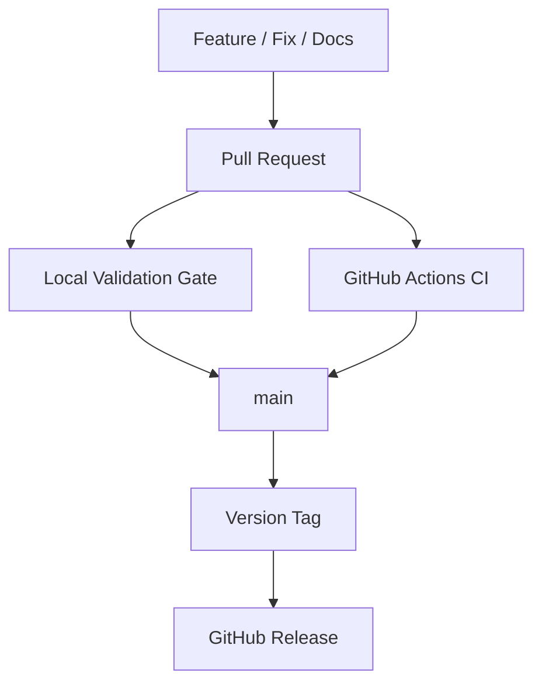

# AI Engineering Standard

<p align="center"><strong>AI Development, Training & Agent Engineering Standards</strong></p>
<p align="center"><strong>v2.2.0 — Contract-First Multi-Agent Engineering</strong></p>

<p align="center">
  <a href="https://github.com/eaglesjo/AIEngineeringStandard/releases"></a>
  <a href="LICENSE"></a>
</p>

**Language:** [한국어](i18n/ko/README.md)

## What is AI Engineering Standard?

AI Engineering Standard is a reusable engineering standard for AI-assisted development, model training, experimentation, LLM/Vision workflows, general ML/DL workflows, and AI coding agents.

Version 2 establishes a machine-readable architecture and policy contract, explicit agent/Skill routing, environment-aware runtime behavior, cross-platform installation lifecycle controls, Korean localization quality gates, executable conformance checks, and dependency-compatibility alignment rules. Version 2.1 extends this foundation with framework-neutral multi-agent contracts for Agent, Agent Role, Agent Contract, Work Unit, Handoff, Evidence, Evaluation, and Acceptance. Version 2.2.0 provides the versioned PyPI package and cross-platform CLI as the primary consumer installation interface.

## Independent repository model

This repository is the **single source of truth for development, validation, and release**.



Local validation and GitHub Actions CI verify the same repository state before changes reach `main`. GitHub Actions is an automated verification and bounded execution mechanism; it is not a second source of truth or a replacement repository.

There is no separate private repository, development repository, staging repository, or promotion/export step.

## 2.1 architecture

Version 2.1 extends the 2.0 foundation without replacing it. The canonical unit is the Work Unit, with explicit Agent/Role contracts, Handoffs, Evidence, Evaluation, and Acceptance. Contract definitions live under `core/contracts/2.1/`; architecture guidance lives under `docs/architecture/2.1/`.

Version 2.0.0, 2.0.1, and 2.0.2 remain preserved as historical release provenance. Starting with 2.0.1, development and release are performed directly in this repository under the independent release contract.

## Quick start

Install the published package; consumer projects do not need to clone this repository.

### Recommended: pipx

```bash
pipx install ai-engineering-standard==2.2.0
ai-engineering-standard install --language ko --domain all
```

Preview without writing:

```bash
ai-engineering-standard install --language ko --domain all --dry-run
```

### Alternative: pip

```bash
python -m pip install ai-engineering-standard==2.2.0
ai-engineering-standard install --language ko --domain all
```

The package provides one cross-platform CLI for installation, state inspection, update/reconciliation, validation, and safe uninstall. Shell and PowerShell installer scripts remain development/source-tree compatibility entrypoints rather than the primary consumer interface.

Available domains are `common`, `ml`, `llm`, `vision`, `colab`, and `all`. The canonical source language is English, with Korean as the only supported localized locale. Supported locales are defined by `i18n/languages.json`; the installer derives its accepted locale set from that catalog.

## v2.2.0 release smoke test

The published PyPI package was smoke-tested in an isolated Python 3.14 virtual environment on macOS using version `2.2.0`.

Tested flow:

```bash
python3 -m venv /tmp/aes-v220-test
source /tmp/aes-v220-test/bin/activate
python -m pip install ai-engineering-standard==2.2.0
ai-engineering-standard --version

mkdir -p /tmp/aes-v220-consumer
ai-engineering-standard install \
  --target /tmp/aes-v220-consumer \
  --language ko \
  --domain common \
  --policy overwrite
ai-engineering-standard status --target /tmp/aes-v220-consumer --json
ai-engineering-standard validate --target /tmp/aes-v220-consumer
```

Observed result:

- Package installation and CLI version check succeeded (`ai-engineering-standard 2.2.0`).
- Korean `common` domain installation completed with 18 files.
- Status and validation reported `installed: true`, version `2.2.0`, language `ko`, domain `common`, `missing: 0`, and `modified: 0`.

This is a smoke test of the published package's installation and validation flow for Python 3.14, Korean, and the `common` domain. It does not claim that every domain or locale combination was tested.

## Installation lifecycle

Successful installs record ownership and hashes in `.codingstandard/installation.json`. The installer supports state inspection, update/reconciliation, safe uninstall, and explicit force mode for recovery.

See [`INSTALL.md`](INSTALL.md) for the complete installation contract.

## Release links

- [GitHub Release v2.2.0](https://github.com/eaglesjo/AIEngineeringStandard/releases/tag/v2.2.0)
- [PyPI package v2.2.0](https://pypi.org/project/ai-engineering-standard/2.2.0/)
- [GitHub Actions release workflow](https://github.com/eaglesjo/AIEngineeringStandard/actions/runs/37793199850)
