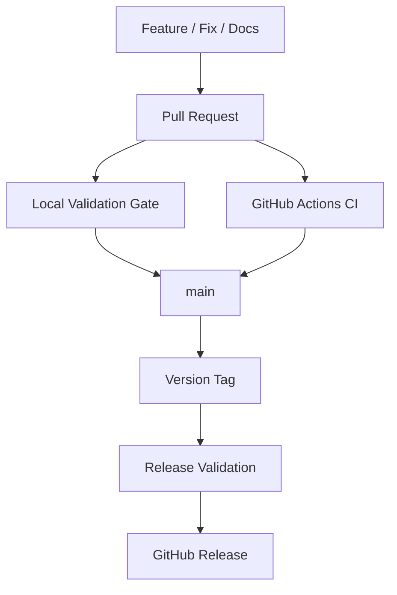

# AI Engineering Standard

<p align="center"><strong>AI Development, Training & Agent Engineering Standards</strong></p>
<p align="center"><strong>v2.1.0 — Contract-First Multi-Agent Engineering</strong></p>

<p align="center">
  <a href="https://github.com/eaglesjo/AIEngineeringStandard/releases"></a>
  <a href="LICENSE"></a>
</p>

**Language:** [한국어](i18n/ko/README.md)

## What is AI Engineering Standard?

AI Engineering Standard is a reusable engineering standard for AI-assisted development, model training, experimentation, LLM/Vision workflows, general ML/DL workflows, and AI coding agents.

Version 2 establishes a machine-readable architecture and policy contract, explicit agent/Skill routing, environment-aware runtime behavior, cross-platform installation lifecycle controls, Korean localization quality gates, executable conformance checks, and dependency-compatibility alignment rules. Version 2.1 extends this foundation with framework-neutral multi-agent contracts for Agent, Agent Role, Agent Contract, Work Unit, Handoff, Evidence, Evaluation, and Acceptance.

## Independent repository model

This repository is the **single source of truth for development, validation, and release**.



Local validation and GitHub Actions CI execute the same repository validation contract. GitHub Actions is an automated verification and bounded execution mechanism; it is not a second source of truth or a replacement repository.

There is no separate private repository, development repository, staging repository, or promotion/export step.

## 2.1 architecture

Version 2.1 extends the 2.0 foundation without replacing it. The canonical unit is the Work Unit, with explicit Agent/Role contracts, Handoffs, Evidence, Evaluation, and Acceptance. Contract definitions live under `core/contracts/2.1/`; architecture guidance lives under `docs/architecture/2.1/`.

Version 2.0.0, 2.0.1, and 2.0.2 remain preserved as historical release provenance. Starting with 2.0.1, development and release are performed directly in this repository under the independent release contract.

## Quick start

Clone the repository into the project you want to configure.

### Windows / PowerShell

```powershell
git clone https://github.com/eaglesjo/AIEngineeringStandard.git
powershell -ExecutionPolicy Bypass -File .\AIEngineeringStandard\scripts\installers\install-domains.ps1 -Target .
```

### Linux / macOS

```bash
git clone https://github.com/eaglesjo/AIEngineeringStandard.git
bash ./AIEngineeringStandard/scripts/installers/install-domains.sh .
```

Available domains are `common`, `ml`, `llm`, `vision`, `colab`, and `all`. The canonical source language is English, with Korean as the only supported localized locale. Supported locales are defined by `i18n/languages.json`; the installer derives its accepted locale set from that catalog.

## Installation lifecycle

Successful installs record ownership and hashes in `.codingstandard/installation.json`. The installer supports state inspection, update/reconciliation, safe uninstall, and explicit force mode for recovery.

See [`INSTALL.md`](INSTALL.md) for the complete installation contract.

## Repository structure

```
.
├── AGENTS.md
├── core/{agent,common,contracts,mcp,plugin,skill,validation}/
├── domains/{ml,llm,vision}/
├── platform/colab/
├── examples/colab/
├── docs/{architecture,development,releases}/
├── i18n/
├── profiles/
├── compatibility/
├── scripts/{development,installers,release,validation}/
├── tests/
└── VERSION
```

## Validation

Run the complete repository gate before merge or release:

```bash
python3 scripts/validation/validate.py
python3 scripts/installers/test_installers.py
python3 scripts/validation/validate_2_1_contracts.py
```

## Release workflow

After merging a release-ready commit to `main`:

```bash
python3 scripts/release/check_release.py
python3 scripts/release/publish_release.py
```

The preflight requires a clean local `main` that exactly matches `origin/main`, runs the full validation and installer lifecycle gates, and rejects an existing version tag. The publish command creates an annotated `v<VERSION>` tag and then creates the GitHub Release through the authenticated `gh` CLI. GitHub Actions remains the automated CI verification path; release publication remains an explicit local release operation.

## Release provenance

Release tags and GitHub Releases are created from this repository only. `scripts/release/check_release.py` validates the exact local `main` state, and `scripts/release/publish_release.py` creates the annotated tag and GitHub Release explicitly. GitHub Actions CI is part of automated repository validation; release publication remains governed by the release preflight and publication contract.

Historical tags and commits, including `v2.0.0`, are preserved.
